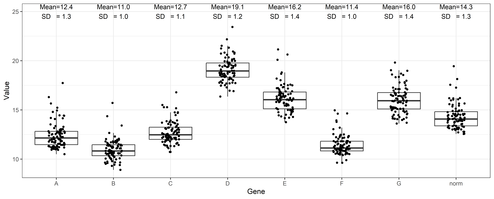
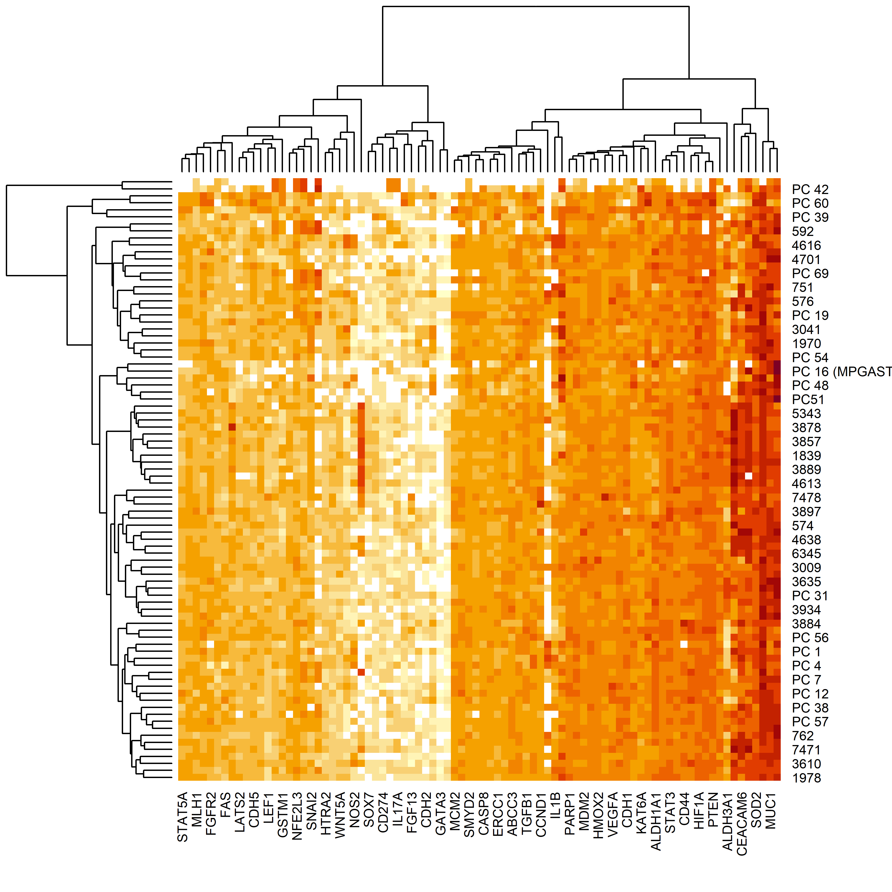

<!-- Changing h2 -->
<style>
h2 {
  color: #0073e6;
}
</style>

```{r setup, include=FALSE}

renv::init()
renv::install(c('dplyr','tidyverse','EnvStats'))
```

# Calling packages and reading input files

## Calling Required Packages


```{r warning=FALSE, message=FALSE}
library(dplyr)
library(tidyverse)
library(EnvStats)

```


<br> <br>
```{r }

```
## Reading data files

This analysis started with two files. The first one including expression data obtained using the Fluidigm System and the second one including clinical information from these patients. All files can be found in the 'Input files' folder.

```{r }

#Loading expression data
read.csv('Input files/resultados Placa TEG 29_09_23_dXPRESS.csv')->expr_data

expr_data<-expr_data%>%dplyr::filter(!(Name %in% c("PC 8","PC 9","PC 14",   
                                           "PC 22","PC 30","PC 45",
                                           "PC 63","775", "3014"))) #Excluding cases with neoadjuvancy and CECs

#Formatting all expression values as numeric data
as.numeric(expr_data$Value)->expr_data$Value

```
<br> <br>
```{r }

```
# Gene Expression Normalization

## Subsetting housekeeping genes and showing expression levels

In this step, we separated data from housekeeping genes in this analysis: A (ACTB), B (B2M), C(GAPDH), D(GUSB), E(HPRT1), F(RPLP0), and G(TFRC).
According with an in-parallel analysis ran in [NormFinder](https://www.moma.dk/software/normfinder) through [dXpress app](https://rdcu.be/dpQtN), genes 'A' (ACTB) and 'E' (HPRT1) were the most relevant to normalize data. In this plot, their combination is shown as 'norm'

```{r message=FALSE, warning=FALSE}
expr_data<-expr_data%>%dplyr::select(-ID)

# Using ggplot2 to generate the boxplot+jitterplot 

p<-expr_data%>%
  subset(Gene %in% c("A","B","C","D","E","F","G"))%>%
  pivot_wider(names_from=Gene,values_from=Value)%>%
  mutate(norm=(A+E)/2)%>% #Selected genes using normfinder
  pivot_longer(!c(Name),names_to="Gene",values_to="Value")%>%
  ggplot(aes(x=Gene,y=Value))+geom_boxplot(outlier.shape = NA)+geom_jitter(size=1,width = .15)+
  theme_bw()+ stat_mean_sd_text(y.pos = 25,size=3.5) 

# Saving this result

png("Results/Housekeeping Profile.png",width = 6200,height = 2500,res=600)
p
dev.off()
```

```{r echo=FALSE }



```
<br> <br>
```{r }

```
## Normalizing the expression of Target Genes
Herein, we will normalize Ct values using 'A' (ACTB) and 'E' (HPRT1) genes.


```{r }
norm_data<-expr_data%>%
  pivot_wider(names_from=Gene,values_from=Value)%>%
  group_by(Name)%>%
  mutate(norm=mean(c(A,E)))%>%
  pivot_longer(!c(Name,norm),names_to="Gene",values_to="Value")%>%
  group_by(Name)%>%
  mutate(Value=norm-Value)%>%
  select(-norm)%>%
  pivot_wider(names_from=Gene,values_from=Value)%>%
  select(-A,-B,-C,-D,-E,-F,-G)

# Setting object as data.frame
data.frame(norm_data)->norm_data
# Configuring Name of samples as rownames
norm_data$Name->rownames(norm_data)

png("Results/heatmap_data_norm.png",width=4000,height = 4000,res=600)
heatmap(as.matrix(norm_data[,-1]))
dev.off()
```
In this moment, we have expression data of  **`r ncol(norm_data[,-1])` genes from  `r nrow(norm_data[,-1])` patients.**
<br> 
```{r }

```
```{r echo=FALSE }



```


<br> <br>
```{r }

```
# Session Info 

Saving Session Info and R-env...

```{r, echo=FALSE, warning = FALSE}
renv::init()
renv::snapshot()
sessioninfo::session_info() |> capture.output() |> writeLines("session-info.txt")

```

