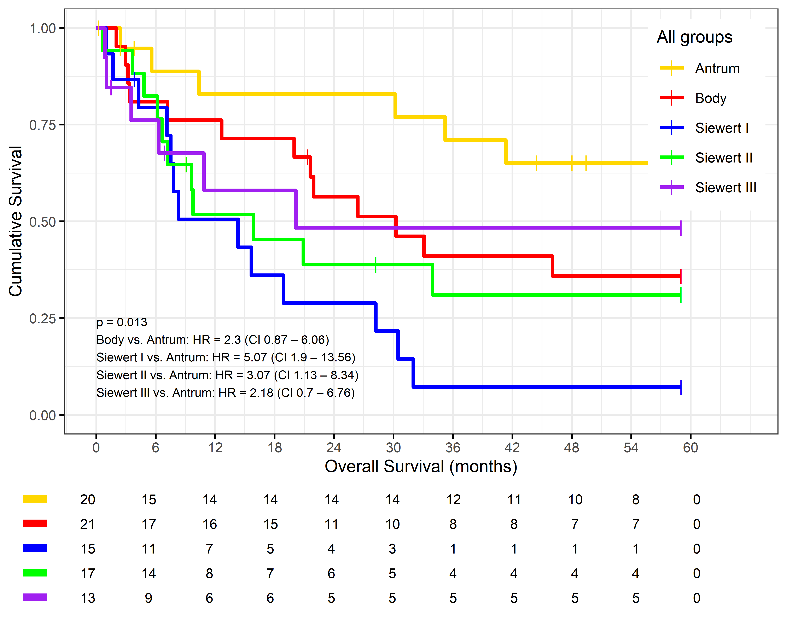
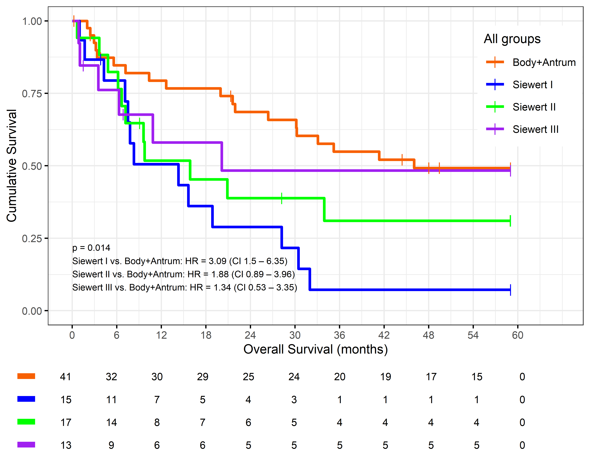
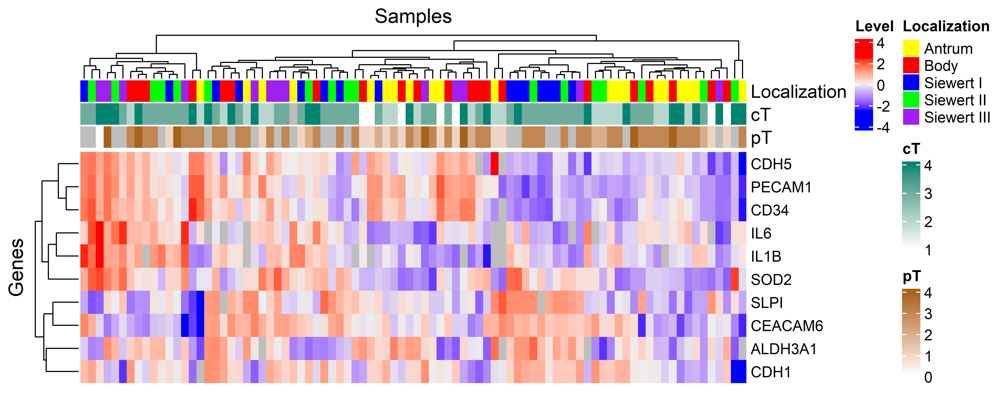
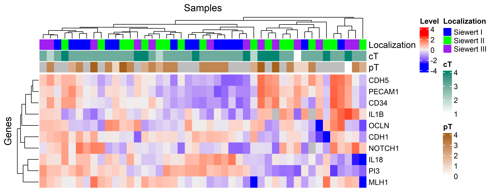
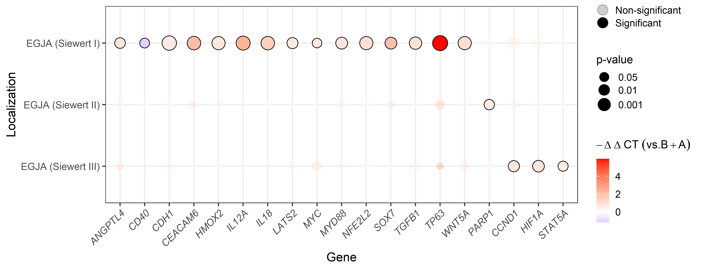
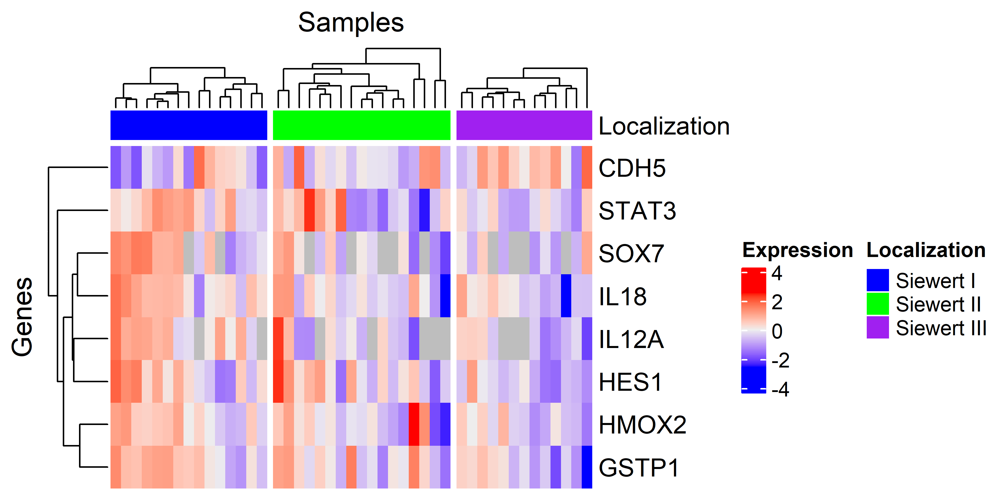

<style>
h2 {
  color: #0073e6;
}
</style>


# 1. Calling packages and reading input files

## 1.1. Calling Required Packages

<details>
<summary style="background-color:#104E8B; color:white; padding:10px; border-radius:6px; cursor:pointer; font-weight:bold;">Hide/Show Code</summary>

```{r call libraries, warning=FALSE, message=FALSE}
library(cardx)
library(circlize)
library(ComplexHeatmap)
library(corrplot)
library(dendsort)
library(DescTools)
library(dplyr)
library(EnvStats)
library(factoextra)
library(ggplot2)
library(ggpubr)
library(gtsummary)
library(readxl)
library(scales)
library(survminer)
library(survivalAnalysis)
library(tibble)
library(tidyverse)
set.seed(1234)

```
</details> 

<br> <br>
```{r sp1}

```
## 1.2. Reading data files

This analysis started with two files. The first one including expression data obtained using the Fluidigm System and the second one including clinical information from these patients. All files can be found in the 'Input files' folder.

<details>
<summary style="background-color:#104E8B; color:white; padding:10px; border-radius:6px; cursor:pointer; font-weight:bold;">Hide/Show Code</summary>
```{r read1.2}

#Loading expression data
read.csv('Input files/resultados Placa TEG 29_09_23_dXPRESS.csv')->expr_data

expr_data<-expr_data%>%dplyr::filter(!(Name %in% c("PC 8","PC 9","PC 14",   
                                           "PC 22","PC 30","PC 45",
                                           "PC 63","775", "3014"))) #Excluding cases with neoadjuvancy and CECs

#Formatting all expression values as numeric data
as.numeric(expr_data$Value)->expr_data$Value

#Loading clinical data
read_excel("Input files/Database EGJA.xlsx",sheet="R")->clinic_data

#Excluding sample without gene expression data.
clinic_data%>%
  filter(Name!=3641)->clinic_data
#Filtering data with available gene expression
#sort(table(c(unique(expr_data$Name),
#        unique(clinic_data$Name))))


```
</details>

<br> <br>
```{r sp2}

```
\newpage
___

# 2. Clinical Profile

## 2.1. Summary Table

We included **`r nrow(clinic_data)` patients** in this study. Below, we represent the summary statistics.


```{r sum2.1}

clinic_data%>%
  mutate(Sex=ifelse(Sex==1,"M","F"),
         cTNM=ifelse(cTNM<3,"1+2","3+4"))%>%
  tbl_summary(      
    statistic = list(
      all_continuous() ~ "{mean} ({min}-{max})",
      all_categorical() ~ "{n} / {N} ({p}%)"
    ),
    digits = all_continuous() ~ 2,
    include = c("Age","Sex","cTNM", "OS"),
    by="Localization",
    missing = "no",
    label = list(OS ~ "Overall Survival (months)")
  ) |>
  add_overall() |> 
  add_n() |> # add column with total number of non-missing observations
  add_p() |> # test for a difference between groups
  modify_header(label = "**Variable**") |> # update the column header
  bold_labels() 
```


Now, we grouped patients in two categories and replicate the summary table


```{r sum2.1.2,warning=FALSE, message=FALSE}

clinic_data%>%
  mutate(Sex=ifelse(Sex==1,"M","F"),
         cTNM=ifelse(cTNM<3,"1+2","3+4"),
         group=ifelse(Localization %in% c('Body','Antrum'),'Body+Antrum','Siewert I-III'))%>%
  tbl_summary(      
    statistic = list(
      all_continuous() ~ "{mean} ({min}-{max})",
      all_categorical() ~ "{n} / {N} ({p}%)"
    ),
    digits = all_continuous() ~ 2,
    include = c("Age","Sex","cTNM", "OS"),
    by="group",
    missing = "no",
    label = list(OS ~ "Overall Survival (months)")
  ) |>
  add_overall() |> 
  add_n() |> # add column with total number of non-missing observations
  add_p() |> # test for a difference between groups
  modify_header(label = "**Variable**") |> # update the column header
  bold_labels() 
```


<br> <br>
```{r sp3}

```

## 2.2. Survival Analysis

Initially, we evaluated survival curves for all features (SWI, SWII, SWIII, Antrum, and Body). 

<details>
<summary style="background-color:#104E8B; color:white; padding:10px; border-radius:6px; cursor:pointer; font-weight:bold;">Hide/Show Code</summary>
```{r surv2.2,message=F,warning=F}

# Creating object with survival info
clinic_data%>%
  analyse_survival(vars(OS*30, Death), by='Localization') ->result_srv

# Calling p-value
pluck_survival_analysis(result_srv,"p")->p_val

# Plotting the graph
png(paste0("Results/Results_KM_TODOS _GRUPOS.png"),width=3800,height = 3000,res=600)
print(kaplan_meier_plot(result_srv,
                        break.time.by="breakByHalfYear",
                        xlab=".OS.months",
                        palette = c("Antrum"="gold",
                                    "Body"="red",
                                    "Siewert I"="blue",
                                    "Siewert II"="green",
                                    "Siewert III"="purple",
                                    " "="grey"),
                        legend.title="All groups",
                        legend=c(.9,.75),
                        pval.coord=c(-0.1,.15),
                        pval.size=2.5,
                        tables.height = 0.22,
                        hazard.ratio=TRUE,
                        risk.table=TRUE,
                        table.layout="clean",
                        ggtheme=ggplot2::theme_bw(10)))
dev.off()
```
</details>

```{r surv2.2.2, echo=FALSE }



```
<br> <br>
After, we grouped all gastric regions **(Body+Antrum)** and repeated the analysis.

<details>
<summary style="background-color:#104E8B; color:white; padding:10px; border-radius:6px; cursor:pointer; font-weight:bold;">Hide/Show Code</summary>
```{r surv2.2.3,message=F,warning=F}

# Creating object with survival info
clinic_data%>%
  mutate(Localization=ifelse(Localization %in% c('Body','Antrum'),
                             'Body+Antrum',
                             Localization))%>%
  analyse_survival(vars(OS*30, Death), by='Localization') ->result_srv

# Calling p-value
pluck_survival_analysis(result_srv,"p")->p_val

# Plotting the graph
png(paste0("Results/Results_KM_four_groups.png"),width=3800,height = 3000,res=600)
print(kaplan_meier_plot(result_srv,
                        break.time.by="breakByHalfYear",
                        xlab=".OS.months",
                        palette = c("Body+Antrum"="#f76002",
                                    "Siewert I"="blue",
                                    "Siewert II"="green",
                                    "Siewert III"="purple",
                                    " "="grey"),
                        legend.title="All groups",
                        legend=c(.9,.75),
                        pval.coord=c(-0.1,.15),
                        pval.size=2.5,
                        tables.height = 0.22,
                        hazard.ratio=TRUE,
                        risk.table=TRUE,
                        table.layout="clean",
                        ggtheme=ggplot2::theme_bw(10)))
dev.off()

```
</details>

```{r surv2.2.4, echo=FALSE }



```
<br> <br>
```{r sp3.4}

```
\newpage
___

# 3. Gene Expression Normalization

## 3.1. Subsetting housekeeping genes and showing expression levels

In this step, we separated data from housekeeping genes in this analysis: A (*ACTB*), B (*B2M*), C(*GAPDH*), D(*GUSB*), E(*HPRT1*), F(*RPLP0*), and G(*TFRC*).
According with an in-parallel analysis ran in [NormFinder](https://www.moma.dk/software/normfinder) through [dXpress app](https://rdcu.be/dpQtN), genes 'A' (*ACTB*) and 'E' (*HPRT1*) were the most relevant to normalize data. In this plot, their combination is shown as 'norm'.

<details>
<summary style="background-color:#104E8B; color:white; padding:10px; border-radius:6px; cursor:pointer; font-weight:bold;">Hide/Show Code</summary>
```{r subset3.1,message=FALSE, warning=FALSE}
expr_data<-expr_data%>%dplyr::select(-ID)

# Using ggplot2 to generate the boxplot+jitterplot 

p<-expr_data%>%
  subset(Gene %in% c("A","B","C","D","E","F","G"))%>%
  pivot_wider(names_from=Gene,values_from=Value)%>%
  mutate(norm=(A+E)/2)%>% #Selected genes using normfinder
  pivot_longer(!c(Name),names_to="Gene",values_to="Value")%>%
  ggplot(aes(x=Gene,y=Value))+geom_boxplot(outlier.shape = NA)+geom_jitter(size=1,width = .15)+
  theme_bw()+ stat_mean_sd_text(y.pos = 25,size=3.5) 

# Saving this result

png("Results/Housekeeping Profile.png",width = 6200,height = 2500,res=600)
p
dev.off()
```
</details>

```{r subset3.1.2,echo=FALSE }

knitr::include_graphics("Results/Housekeeping Profile.png")

```
<br> <br>
```{r sp4}

```

## 3.2. Normalizing the expression of Target Genes
Herein, we will normalize Ct values using 'A' (*ACTB*) and 'E' (*HPRT1*) genes. 

<details>
<summary style="background-color:#104E8B; color:white; padding:10px; border-radius:6px; cursor:pointer; font-weight:bold;">Hide/Show Code</summary>
```{r norm3.2}
norm_data<-expr_data%>%
  pivot_wider(names_from=Gene,values_from=Value)%>%
  group_by(Name)%>%
  mutate(norm=mean(c(A,E)))%>%
  pivot_longer(!c(Name,norm),names_to="Gene",values_to="Value")%>%
  group_by(Name)%>%
  mutate(Value=norm-Value)%>%
  select(-norm)%>%
  pivot_wider(names_from=Gene,values_from=Value)%>%
  select(-A,-B,-C,-D,-E,-F,-G)

# Setting object as data.frame
data.frame(norm_data)->norm_data
# Configuring Name of samples as rownames
norm_data$Name->rownames(norm_data)

png("Results/heatmap_data_norm.png",width=4000,height = 4000,res=600)
heatmap(as.matrix(norm_data[,-1]))
dev.off()
```
</details>

At this moment, we have expression data of  **`r ncol(norm_data[,-1])` genes from  `r nrow(norm_data[,-1])` patients.** Patient 3641 has no expression data with passed QC. Blank cells represent missing values.
<br> 
```{r sp5}

```
```{r norm3.2.2,echo=FALSE }

knitr::include_graphics("Results/heatmap_data_norm.png")

```


<br> <br>
```{r sp6}

```
\newpage
___

# 4. Unsupervised Analysis (All localizations)

## 4.1. Removing gene/patients with missing data
Before beginning the unsupervised analysis, we need to reduce the number of missing cases in this dataset. To do this, we initially excluded samples with 20% or more missing cases, then reduced genes or patients with 10% or more missing cases. Finally, we screen the database for genes/patients with complete information.

<details>
<summary style="background-color:#104E8B; color:white; padding:10px; border-radius:6px; cursor:pointer; font-weight:bold;">Hide/Show Code</summary>
```{r remov4.1}
# Excluding genes/patients with over 20% missing data
names(tail(sort(colSums(is.na(norm_data))/nrow(norm_data)),10))->exclude_20
#exclude_20
norm_data_pca<-norm_data%>%
  select(-any_of(exclude_20))
norm_data_pca$Name->rownames(norm_data_pca)
names(tail(sort(colSums(is.na(t(norm_data_pca)))/ncol(norm_data_pca)),3))->exclude_20
#exclude_20
norm_data_pca<-norm_data_pca%>%
  filter(!(Name %in% exclude_20))

# Excluding genes/patients with over 10% missing data
names(tail(sort(colSums(is.na(norm_data_pca))/nrow(norm_data_pca)),5))->exclude_10
#exclude_10
norm_data_pca<-norm_data_pca%>%
  select(-any_of(exclude_10))
norm_data_pca$Name->rownames(norm_data_pca)
colSums(is.na(t(norm_data_pca)))/ncol(norm_data_pca)->exclude_10
#exclude_10
names(exclude_10[which(exclude_10!=0)])->exclude_10
#exclude_10
norm_data_pca<-norm_data_pca%>%
  filter(!(Name %in% exclude_10))
```
</details>

At this moment, we have expression data of  **`r ncol(norm_data_pca[,-1])` genes from  `r nrow(norm_data_pca[,-1])` patients.**

List of genes for this analysis: **`r stringr::str_replace_all(paste(colnames(norm_data_pca[, -1]), collapse = ", "), "((?:[^,]+, ){14}[^,]+), ", "\\1\n")`**

```{r remov4.1.2}
heatmap(as.matrix(norm_data_pca[,-1]))
```

<br> <br>
```{r sp7}

```

## 4.2. Principal Component Analysis (PCA)
For this part, we seek to eliminate genes with low expression (cutoff: -8) and/or low variability (cutoff: 0.8).


```{r pca4.2}
# Filtering genes with low expression (-dCT < -8)
expr_filtered <- norm_data_pca[,-1] %>%
  select(where(~ mean(.x, na.rm = TRUE) > -8))
```

After this first filter, we retrieved data of  **`r ncol(expr_filtered)` genes from  `r nrow(expr_filtered)` patients.**

```{r pca4.2.2}
# Filtering genes with low variability (sd < 0.8)
expr_filtered <- expr_filtered %>%
  select(where(~ sd(.x, na.rm = TRUE) > 0.8))
```

After this filter, we retrieved data of  **`r ncol(expr_filtered)` genes from  `r nrow(expr_filtered)` patients.**

```{r pca4.2.3}
# Scaling data and running PCA
expr_scaled <- scale(expr_filtered)  
pca_result <- prcomp(expr_scaled, center = TRUE, scale. = TRUE)

# Observing components contribution to variance
p<-fviz_eig(pca_result, addlabels = TRUE,ncp = 20) 
```

Herein, we require 10 components to achieve over 70% of the explained variance.

```{r pca4.2.4}
p
```

Using these 10 components, we retrieved the top 10 relevant genes.

```{r pca4.2.5}
p<-fviz_cos2(pca_result, choice = "var", axes = 1:15,top = 10,
             fill = "lightgray", color = "black") +
  theme_minimal() +
  theme(axis.text.x = element_text(angle=45))
p

```
<br>
```{r sp8}

```
**Top 10 relevant genes: `r stringr::str_replace_all(paste0(p$data%>%arrange(desc(cos2))%>%top_n(10)%>%select(name)%>%as.matrix(),collapse=', '), "((?:[^,]+, ){14}[^,]+), ", "\\1\n")`**

After that, we plotted all samples according to their values in the first and second components. We also included clinical information to highlight the localization of these samples using ellipses.


```{r pca4.2.6}
# Combining with clinical information
pca_df <- as_tibble(pca_result$x[, 1:2]) %>%
  mutate(Name = norm_data_pca$Name)%>%
  left_join(clinic_data,'Name')

# Visualizing PCA results with 95% confidence interval for ellipses showing groups
ggplot(pca_df, aes(x = PC1, y = PC2, color = Localization, label = Name)) +
  geom_point(size = 3, alpha = 0.8) +
  geom_text(vjust = -1.2, size = 2.5, check_overlap = TRUE) +
  stat_ellipse(type = "norm", level = 0.95, linetype = "dashed") +
  labs(
    title = "PCA based on Gene Expression (-dCt)",
    x = paste0("PC1 (", scales::percent(summary(pca_result)$importance[2, 1]), " var)"),
    y = paste0("PC2 (", scales::percent(summary(pca_result)$importance[2, 2]), " var)")
  ) +
  theme_minimal()
```


<br> <br>
```{r sp9}

```

## 4.3. Heatmap with relevant genes from Unsupervised Analysis

<details>
<summary style="background-color:#104E8B; color:white; padding:10px; border-radius:6px; cursor:pointer; font-weight:bold;">Hide/Show Code</summary>
```{r heat4.3}
set.seed(1234)
#Selecting relevant genes
top_genes <- p$data %>%
  arrange(desc(cos2)) %>%
  slice_head(n = 10) %>%
  pull(name)

# Creating dataframe for heatmap
for_heat <- norm_data_pca %>%
  left_join(clinic_data, by = "Name") %>%
  select(Name, Localization, 
         cT,pT,
         all_of(top_genes))

df <- for_heat[,-c(1:4)]
row_dend = dendsort(hclust(dist(t(df))))
col_dend = dendsort(hclust(dist(df),"ward.D"))

ha = HeatmapAnnotation(Localization = as.factor(for_heat[,2]),
                       cT=for_heat[,3],
                       pT=for_heat[,4],
                       col = list( Localization = c("Antrum"="yellow",
                                                    "Body"="red",
                                                    "Siewert I"="blue",
                                                    "Siewert II"="green",
                                                    "Siewert III"="purple",
                                                    " "="grey80"),
                                   cT = colorRamp2(c(min(for_heat[,3], na.rm=TRUE),
                                                     max(for_heat[,3], na.rm=TRUE)),
                                                   c("white", "#018571")),
                                   pT = colorRamp2(c(min(for_heat[,4], na.rm=TRUE),
                                                     max(for_heat[,4], na.rm=TRUE)),
                                                   c("white", "#A6611A"))))


p<-Heatmap(t(scale(df)), 
           name = "Level", #title of legend
           column_title = "Samples", 
           row_title = "Genes",
           column_names_gp=gpar(fontsize=7),
           row_km=3,
           column_km=4,
           row_names_gp = gpar(fontsize = 10),
           top_annotation = ha,
           column_labels = c(rep("",nrow(expr_filtered))) #Removing column (sample) names
)
```
</details>

```{r heat4.3.2,fig.width=10, fig.height=4, fig.fullwidth=TRUE}
p


```


<br> <br>
```{r sp10}

```

## 4.4. Heatmap with relevant genes from Unsupervised Analysis (All samples)

Analysis with data from **`r nrow(norm_data)` patients.**

<details>
<summary style="background-color:#104E8B; color:white; padding:10px; border-radius:6px; cursor:pointer; font-weight:bold;">Hide/Show Code</summary>
```{r heat4.4}

set.seed(1234)
# Creting dataframe with clinical data
for_heat <- norm_data %>%
  left_join(clinic_data, by = "Name") %>%
  select(Name, Localization, 
         cT,pT,
         all_of(top_genes))

# Organizing top annotation
df <- for_heat[,-c(1:4)]
row_dend = dendsort(hclust(dist(t(df))))
col_dend = dendsort(hclust(dist(df),"ward.D"))

ha = HeatmapAnnotation(Localization = as.factor(for_heat[,2]),
                       cT=for_heat[,3],
                       pT=for_heat[,4],
                       col = list( Localization = c("Antrum"="yellow",
                                                    "Body"="red",
                                                    "Siewert I"="blue",
                                                    "Siewert II"="green",
                                                    "Siewert III"="purple",
                                                    " "="grey80"),
                                   cT = colorRamp2(c(min(for_heat[,3], na.rm=TRUE),
                                                     max(for_heat[,3], na.rm=TRUE)),
                                                   c("white", "#018571")),
                                   pT = colorRamp2(c(min(for_heat[,4], na.rm=TRUE),
                                                     max(for_heat[,4], na.rm=TRUE)),
                                                   c("white", "#A6611A"))))

# Plotting Heatmap
p<-Heatmap(t(scale(df)), 
           name = "Level", #title of legend
           column_title = "Samples", 
           row_title = "Genes",
           column_names_gp=gpar(fontsize=7),
           row_names_gp = gpar(fontsize = 10),
           top_annotation = ha,
           column_labels = c(rep("",nrow(norm_data))) #Remove col names
)

# Saving plot

png("Results/Heatmap_Temp_top10.png",width=5500,height = 2200,res=600)
p
dev.off()
```
</details>

```{r heat4.4.2, echo=FALSE }



```


<br> <br>
```{r sp11}

```
\newpage
___

# 5. Unsupervised Analysis (Only Siewert)

## 5.1. Removing gene/patients with missing data
Before beginning the unsupervised analysis, we need to reduce the number of missing cases in this dataset. To do this, we filter for **Siewert** located samples. Then, we excluded samples with 20% or more missing cases, then reduced genes or patients with 10% or more missing cases. Finally, we screen the database for genes/patients with complete information.

<details>
<summary style="background-color:#104E8B; color:white; padding:10px; border-radius:6px; cursor:pointer; font-weight:bold;">Hide/Show Code</summary>
```{r remov5.1}
# Filtering Siewert Samples
colnames(norm_data[,-1])->analysis_genes

for_Siewert <- norm_data %>%
  left_join(clinic_data, by = "Name") %>%
  filter(Localization %in% c('Siewert I',
                             'Siewert II',
                             'Siewert III'))%>%
  select(Name,
         all_of(analysis_genes))

# Excluding genes/patients with over 20% missing data
names(tail(sort(colSums(is.na(for_Siewert))/nrow(for_Siewert)),10))->exclude_20
#exclude_20
norm_data_pca<-for_Siewert%>%
  select(-any_of(exclude_20))
norm_data_pca$Name->rownames(norm_data_pca)
names(tail(sort(colSums(is.na(t(norm_data_pca)))/ncol(norm_data_pca)),3))->exclude_20
#exclude_20
norm_data_pca<-norm_data_pca%>%
  filter(!(Name %in% exclude_20))

# Excluding genes/patients with over 10% missing data
names(tail(sort(colSums(is.na(norm_data_pca))/nrow(norm_data_pca)),5))->exclude_10
#exclude_10
norm_data_pca<-norm_data_pca%>%
  select(-any_of(exclude_10))
norm_data_pca$Name->rownames(norm_data_pca)
colSums(is.na(t(norm_data_pca)))/ncol(norm_data_pca)->exclude_10
#exclude_10
names(exclude_10[which(exclude_10!=0)])->exclude_10
#exclude_10
norm_data_pca<-norm_data_pca%>%
  filter(!(Name %in% exclude_10))
```
</details>
<br>
<br>
```{r sp12}

```
At this moment, we have expression data of  **`r ncol(norm_data_pca[,-1])` genes from  `r nrow(norm_data_pca[,-1])` patients.**

List of genes for this analysis: **`r stringr::str_replace_all(paste(colnames(norm_data_pca[, -1]), collapse = ", "), "((?:[^,]+, ){14}[^,]+), ", "\\1\n")`**
<br>
```{r remov5.1.2}
heatmap(as.matrix(norm_data_pca[,-1]))
```

<br> <br>
```{r sp13}

```
<br>
\newline

## 5.2. Principal Component Analysis (PCA)

For this part, we seek to eliminate genes with low expression (cutoff: -8) and/or low variability (cutoff: 0.8).

```{r pca5.2}
# Filtering genes with low expression (-dCT < -8)
expr_filtered <- norm_data_pca[,-1] %>%
  select(where(~ mean(.x, na.rm = TRUE) > -8))
```

After this first filter, we retrieved data of  **`r ncol(expr_filtered)` genes from  `r nrow(expr_filtered)` patients.**

```{r pca5.2.2}
# Filtering genes with low variability (sd < 0.8)
expr_filtered <- expr_filtered %>%
  select(where(~ sd(.x, na.rm = TRUE) > 0.8))
```

After this filter, we retrieved data of  **`r ncol(expr_filtered)` genes from  `r nrow(expr_filtered)` patients.**

```{r pca5.2.3}
# Scaling data and running PCA
expr_scaled <- scale(expr_filtered)  
pca_result <- prcomp(expr_scaled, center = TRUE, scale. = TRUE)

# Observing components contribution to variance
p<-fviz_eig(pca_result, addlabels = TRUE,ncp = 20) 
```

Herein, we require 10 components to achieve over 80% of the explained variance.

```{r pca5.2.4}
p
```

Using these 10 components, we retrieved the top 10 relevant genes.

```{r pca5.2.5}
p<-fviz_cos2(pca_result, choice = "var", axes = 1:15,top = 10,
             fill = "lightgray", color = "black") +
  theme_minimal() +
  theme(axis.text.x = element_text(angle=45))
p

```
<br>
```{r sp13.2}

```

**Top 10 relevant genes: `r stringr::str_replace_all(paste0(p$data%>%arrange(desc(cos2))%>%top_n(10)%>%select(name)%>%as.matrix(),collapse=', '), "((?:[^,]+, ){14}[^,]+), ", "\\1\n")`**

After that, we plotted all samples according to their values in the first and second components. We also included clinical information to highlight the localization of these samples using ellipses.

```{r pca5.2.6}
# Combining with clinical information
pca_df <- as_tibble(pca_result$x[, 1:2]) %>%
  mutate(Name = norm_data_pca$Name)%>%
  left_join(clinic_data,'Name')

# Visualizing PCA results with 95% confidence interval for ellipses showing groups
ggplot(pca_df, aes(x = PC1, y = PC2, color = Localization, label = Name)) +
  geom_point(size = 3, alpha = 0.8) +
  geom_text(vjust = -1.2, size = 2.5, check_overlap = TRUE) +
  stat_ellipse(type = "norm", level = 0.95, linetype = "dashed") +
  labs(
    title = "PCA based on Gene Expression (-dCt)",
    x = paste0("PC1 (", scales::percent(summary(pca_result)$importance[2, 1]), " var)"),
    y = paste0("PC2 (", scales::percent(summary(pca_result)$importance[2, 2]), " var)")
  ) +
  theme_minimal()
```

<br> <br>
```{r sp14}

```
<br>
\newline

## 5.3. Heatmap with relevant genes from Unsupervised Analysis

<details>
<summary style="background-color:#104E8B; color:white; padding:10px; border-radius:6px; cursor:pointer; font-weight:bold;">Hide/Show Code</summary>
```{r heat5.3}
set.seed(1234)
#Selecting relevant genes
top_genes <- p$data %>%
  arrange(desc(cos2)) %>%
  slice_head(n = 10) %>%
  pull(name)

# Creating dataframe for heatmap
for_heat <- norm_data_pca %>%
  left_join(clinic_data, by = "Name") %>%
  select(Name, Localization, 
         cT,pT,
         all_of(top_genes))

df <- for_heat[,-c(1:4)]
row_dend = dendsort(hclust(dist(t(df))))
col_dend = dendsort(hclust(dist(df),"ward.D"))

ha = HeatmapAnnotation(Localization = as.factor(for_heat[,2]),
                       cT=for_heat[,3],
                       pT=for_heat[,4],
                       col = list( Localization = c("Antrum"="yellow",
                                                    "Body"="red",
                                                    "Siewert I"="blue",
                                                    "Siewert II"="green",
                                                    "Siewert III"="purple",
                                                    " "="grey80"),
                                   cT = colorRamp2(c(min(for_heat[,3], na.rm=TRUE),
                                                     max(for_heat[,3], na.rm=TRUE)),
                                                   c("white", "#018571")),
                                   pT = colorRamp2(c(min(for_heat[,4], na.rm=TRUE),
                                                     max(for_heat[,4], na.rm=TRUE)),
                                                   c("white", "#A6611A"))))


p<-Heatmap(t(scale(df)), 
           name = "Level", #title of legend
           column_title = "Samples", 
           row_title = "Genes",
           column_names_gp=gpar(fontsize=7),
           row_km=3,
           column_km=2,
           row_names_gp = gpar(fontsize = 10),
           top_annotation = ha,
           column_labels = c(rep("",nrow(expr_filtered))) #Removing column (sample) names
)
```
</details>

```{r heat5.3.2,fig.width=10, fig.height=4, out.width="80%"}
p


```

<br> <br>
```{r sp15}

```
<br>
\newline

## 5.4. Heatmap with relevant genes from Unsupervised Analysis (All Siewert samples)

Analysis with data from **`r nrow(for_Siewert)` patients.**

<details>
<summary style="background-color:#104E8B; color:white; padding:10px; border-radius:6px; cursor:pointer; font-weight:bold;">Hide/Show Code</summary>
```{r heat5.4}
set.seed(1234)

# Creting dataframe with clinical data
for_heat <- for_Siewert %>%
  left_join(clinic_data, by = "Name") %>%
  select(Name, Localization, 
         cT,pT,
         all_of(top_genes))

# Organizing top annotation
df <- for_heat[,-c(1:4)]
row_dend = dendsort(hclust(dist(t(df))))
col_dend = dendsort(hclust(dist(df),"ward.D"))

ha = HeatmapAnnotation(Localization = as.factor(for_heat[,2]),
                       cT=for_heat[,3],
                       pT=for_heat[,4],
                       col = list( Localization = c("Antrum"="yellow",
                                                    "Body"="red",
                                                    "Siewert I"="blue",
                                                    "Siewert II"="green",
                                                    "Siewert III"="purple",
                                                    " "="grey80"),
                                   cT = colorRamp2(c(min(for_heat[,3], na.rm=TRUE),
                                                     max(for_heat[,3], na.rm=TRUE)),
                                                   c("white", "#018571")),
                                   pT = colorRamp2(c(min(for_heat[,4], na.rm=TRUE),
                                                     max(for_heat[,4], na.rm=TRUE)),
                                                   c("white", "#A6611A"))))

# Plotting Heatmap
p<-Heatmap(t(scale(df)), 
           name = "Level", #title of legend
           column_title = "Samples", 
           row_title = "Genes",
           column_names_gp=gpar(fontsize=7),
           row_names_gp = gpar(fontsize = 10),
           top_annotation = ha,
           column_labels = c(rep("",nrow(for_Siewert))) #Remove col names
)

# Saving plot

png("Results/Heatmap_Siewert_Temp_top10.png",width=5500,height = 2200,res=600)
p
dev.off()
```
</details>

```{r heat5.4.2,echo=FALSE }



```

<br> <br>
```{r sp16}

```
\newpage
___

# 6. Differential Expression Analyses

## 6.1. Groups comparison (Kruskal-Wallis followed by Bonferroni Post-hoc test)
In this topic, we compared the analysis of several groups using Kruskal-Wallis, followed by a post-hoc adjustment (Bonferroni method). 

<details>
<summary style="background-color:#104E8B; color:white; padding:10px; border-radius:6px; cursor:pointer; font-weight:bold;">Hide/Show Code</summary>
```{r gc6.1}

# Combining expression with clinical data
colnames(norm_data[,-1])->analysis_genes

DEA_data <- norm_data %>%
  left_join(clinic_data, by = "Name") %>%
  select(Name,Localization,
         all_of(analysis_genes))


# Estimating p-values

data.frame(gene=NA,
           Kruskal_Wallis_p_value=NA,
           Par=NA,
           bonf_p_value=NA)->final_KW

for (coluna in 3:ncol(DEA_data)){
  
  result_KW<-aov(get(colnames(DEA_data)[coluna]) ~ Localization, data = DEA_data)  
  
  result_KW2<-kruskal.test(get(colnames(DEA_data)[coluna]) ~ Localization, data = DEA_data) 
  
  if(as.numeric(result_KW2$p.value)<0.05){
    PostHocTest(result_KW, method = "bonf")->bonf
    data.frame(gene=colnames(DEA_data)[coluna],
               Kruskal_Wallis_p_value=as.numeric(result_KW2$p.value),
               Par=rownames(bonf$Localization),
               bonf_p_value=as.matrix(bonf$Localization[,4]))->temp
    
    rbind(final_KW,temp)->final_KW
  }

}
final_KW[-1,]->final_KW

# Formatting data
final_KW<-final_KW%>%pivot_wider(names_from=Par,values_from = bonf_p_value)

# Selecting genes with no pairwise expression differences
final_KW%>%
  pivot_longer(!gene,names_to="Comparison",values_to="val")%>%
  group_by(gene)%>%
  summarize(n=sum(val>0.05))%>%
  filter(n==10)%>%
  select(gene)%>%
  as.matrix()->filter_genes_AOV

# Filtering relevant genes

final_KW%>%
  filter(!(gene %in% filter_genes_AOV))->final_KW

# Organizing data to be plotted
final_KW$gene->gene_list
as.matrix(as.data.frame(final_KW[,-c(1,2)],
                        stringsAsFactors = FALSE))->final_KW
rownames(final_KW)<-gene_list
colnames(final_KW)<-c('Gastric Body vs. Antrum','SWI vs. Gastric Antrum','SWII vs. Gastric Antrum',
'SWIII vs. Gastric Antrum','SWI vs. Gastric Body','SWII vs. Gastric Body',
'SWIII vs. Gastric Body','SWI vs. SWII', 'SWI vs. SWIII', 'SWII vs. SWIII')

final_KW[c('STAT3','PI3','EGFR','VEGFA','SOD2','SLPI',
              'NOTCH1','TP63','KRAS','IL18','IGF1R','NFE2L2',
              'IL12A','MDM2','TGFB1','AKT1','WNT5A','RB1',
              'CEACAM6','MYD88'),
            c('SWI vs. SWII','SWI vs. SWIII','SWI vs. Gastric Body','SWI vs. Gastric Antrum',
              'SWII vs. SWIII','SWII vs. Gastric Body','SWII vs. Gastric Antrum',
              'SWIII vs. Gastric Body','SWIII vs. Gastric Antrum','Gastric Body vs. Antrum' )]->final_KW
```
</details>
<br>
```{r gc6.1.2}

# Running a corrplot

corrplot(as.matrix(-1*log10(t(final_KW))),
         p.mat = as.matrix(t(final_KW)),insig = "blank",
         #cl.lim=c(0,10),
         is.corr = FALSE,col = COL2('BrBG', 5),
         tl.col = 'black',tl.srt = 60,title = "Kruskal-Wallis post hoc Bonferroni p-values (-log10)",
         mar = c(1, 1, 5, 1))

```
<br>
A graph was then created showing the most significant p-values in each case.

<br> <br>
```{r sp17}

```
<br>
\newline

## 6.2. Comparing gene expression levels between SWI, SWII, or SWIII, and Gastric Body+Antrum
In this analysis, we pooled data from gastric body and antrum samples (B+A) to identify genes differentially expressed in only one of the Siewert categories compared to gastric tumor regions. We then performed pairwise comparisons of each Siewert group with the gastric sections. Then we selected genes that showed significant differences (FC>1.5 & p-value<0.05) in only one of these comparisons (Gastric Body+Antrum vs. SWI | SWII | SWIII).

<details>
<summary style="background-color:#104E8B; color:white; padding:10px; border-radius:6px; cursor:pointer; font-weight:bold;">Hide/Show Code</summary>
```{r gc6.2,message=F,warning=F}
colnames(norm_data[,-1])->analysis_genes
# Combining clinical and molecular data
DEA_data <- norm_data %>%
  left_join(clinic_data, by = "Name") %>%
  filter(Name !=760)%>% ## CHECAR cOM GASTRO
  select(Name,Localization,
         all_of(analysis_genes))

# Setting parameters and thresholds

thresh<-1.5 #Foldchange threshold
Testa<-c("Siewert I","Siewert II","Siewert III") #Categories to be tested
Testa_name<-c("SWI","SWII","SWIII") #Setting labels
rm(final_result)

for(k in 1:3){
  for(i in 3:ncol(DEA_data)){
    DEA_data%>%
      filter(Localization %in% c(Testa[k],"Body","Antrum"))%>%
      mutate(Group=ifelse(Localization %in% c("Body","Antrum"),
                          "Body+Antrum",
                          Testa_name[k]),
             expr=get(colnames(DEA_data)[i]))%>%
      select(expr,Group)%>%
      as.data.frame()->data_test2
    data_test2%>%
      group_by(Group)%>%
      summarise(x=median(na.omit(expr)))->y
    compare_means(formula =  expr~ Group,data_test2,method="wilcox.test")->x ## Running Kruskal-Wallis two-groups
    if(as.numeric(x$p)<0.05 & abs(y$x[1]-y$x[2])>log2(thresh)){ # Setting thesholds
      #print(x)
      if(exists("final_result")){
        rbind(final_result,data.frame(x,
                                      Gene=colnames(DEA_data)[i],
                                      abs_FC=abs(y$x[1]-y$x[2])))->final_result
      }else{
        data.frame(x,
                   Gene=colnames(DEA_data)[i],
                   abs_FC=abs(y$x[1]-y$x[2]))->final_result
      }
    }
  }
  
}


#Removing duplicated genes (only those p<0.05 and FC>1.5 in one condition)
final_result$Gene[which(! final_result$Gene %in% names(which(table(final_result$Gene)>1)))]->to_select


# Selecting data to be plotted
norm_data %>%
  left_join(clinic_data, by = "Name") %>%
  filter(Name !=760)%>% ## CHECAR cOM GASTRO
  mutate(Group=ifelse(Localization %in% c("Body","Antrum"),
                      "Body+Antrum",
                      Localization))%>%
  select(all_of(to_select),Group)->data_teste2

# Adding pairwise p-values to compare (using Body+Antrum as a reference)
rm(p_valores)
for(i in 1:length(to_select)){
  data_teste2%>%
    mutate(Expr=get(colnames(data_teste2)[i]))->data_teste2
  
  if(exists("p_valores")){
    rbind(p_valores,
          data.frame(Gene=colnames(data_teste2)[i],
               compare_means(Expr~Group,data_teste2,ref.group = "Body+Antrum")))->p_valores
  }else{
    data.frame(Gene=colnames(data_teste2)[i],
               compare_means(Expr~Group,data_teste2,ref.group = "Body+Antrum"))->p_valores
  }
  
  
}

p_valores%>%
  mutate(BUSCA=paste0(group2,Gene))->p_valores

norm_data %>%
  left_join(clinic_data, by = "Name") %>%
  filter(Name !=760)%>% ## CHECAR cOM GASTRO
  mutate(Group=ifelse(Localization %in% c("Body","Antrum"),
                      "Body+Antrum",
                      Localization))%>%
  select(Name,all_of(to_select),Group)%>%
  pivot_longer(!c("Name","Group"),names_to="Genes",values_to="Value")%>%
  group_by(Group,Genes)%>%
  summarise(Value=median(na.omit(Value)))%>%
  group_by(Genes)%>%
  mutate(normal_val=ifelse(Group=="Body+Antrum",Value,NA),
         normal_val=min(na.omit(normal_val)),
         Value=(Value-normal_val))%>%
  filter(Group!="Body+Antrum")%>%
  mutate(BUSCA=paste0(Group,Genes))%>%
  left_join(p_valores,"BUSCA")->resultado_finala
  
# Plotting the final result

resultado_finala%>%
  ggplot(aes(x=factor(Genes,
                       levels=c(resultado_finala%>%
                                  group_by(Genes)%>%
                                  filter(abs(Value)>log2(thresh))%>%
                                  mutate(val_fil=min(p))%>%
                                  filter(val_fil==p,Group=="Siewert I")%>%
                                  select(Genes)%>%as.matrix(),
                                resultado_finala%>%
                                  group_by(Genes)%>%
                                  filter(abs(Value)>log2(thresh))%>%
                                  mutate(val_fil=min(p))%>%
                                  filter(val_fil==p,Group=="Siewert II")%>%
                                  select(Genes)%>%as.matrix(),
                                resultado_finala%>%
                                  group_by(Genes)%>%
                                  filter(abs(Value)>log2(thresh))%>%
                                  mutate(val_fil=min(p))%>%
                                  filter(val_fil==p,Group=="Siewert III")%>%
                                  select(Genes)%>%as.matrix())),
             y=factor(Group,
                      levels=c("Body+Antrum",
                               "Siewert III","Siewert II",
                               "Siewert I")),
             color=Value,size=-1*(log10(p)),
             alpha=ifelse( p<0.05 & (abs(Value)>log2(thresh)),1,.5)))+
  geom_point()+
  geom_point(data = resultado_finala%>%
               filter(p<0.05 & (abs(Value)>log2(thresh))),shape=21,color="black")+
  theme_bw()+
  theme(legend.title = element_text(size=10),
        legend.key.height = unit(0.4, 'cm'),
        legend.key.width = unit(0.4, 'cm'),
        axis.text.x = element_text(face = "italic"))+
  guides(
    alpha = guide_legend(override.aes = list(size = 4)))+
  
  ylab("Localization")+xlab("Gene")+
  scale_color_gradient2(name=bquote(-Delta~Delta~CT~(vs.B+A)),midpoint=0, low="blue", mid="white",
                         high="red", space ="Lab" )+ 
  scale_alpha_continuous(name="Result",lim=c(0,1),breaks=c(0.1,1),
                         labels=c("Non-significant","Significant"))+
  scale_size_continuous(name="p-value",
                        breaks=c(-log10(0.05),-log10(0.01),-log10(0.001)),
                        labels=c("0.05","0.01","0.001"))+ 
  scale_y_discrete(labels=c("Antrum"="Antrum",
                            "Body"="Body",
                            "Siewert I"="EGJA (Siewert I)",
                            "Siewert II"="EGJA (Siewert II)",
                            "Siewert III"="EGJA (Siewert III)",
                            " "="NA"))+
  theme(axis.text.x = element_text(angle=45,hjust=1))->p

png(paste0("Results/RESULTADOS_EXP_exclusiva_Siewert_",thresh,"_TODAS AMOSTRAS.png"),
    width=5200,height = 2000,res=600)
print(p)
dev.off()
```
</details>

```{r gc6.2.2,echo=FALSE }



```
<br> <br>
```{r sp18}

```

## 6.3. Assessing Siewert Transition from SWI to SWIII
In this topic, we hypothesize that the SWII region is at the transition between SWI and SWIII. Therefore, we expect to see a gradient from more to less (or vice versa) in the expression levels of certain genes between SWI, SWII, and SWIII. This analysis searches for genes with a significant difference in expression (**Kruskal-Wallis, p<0.05**) between SWI and SWIII. After, among those preselected genes, the system looks for those where the expression of SWII is in the middle of the other regions. Finally, a heatmap is deployed to show those profiles.

<details>
<summary style="background-color:#104E8B; color:white; padding:10px; border-radius:6px; cursor:pointer; font-weight:bold;">Hide/Show Code</summary>
```{r as6.3,warning=F,message=F}

colnames(norm_data[,-1])->analysis_genes
# Combining clinical and molecular data
DEA_data <- norm_data %>%
  left_join(clinic_data, by = "Name") %>%
  filter(Name !=760)%>% ## CHECAR cOM GASTRO
  select(Name,Localization,
         all_of(analysis_genes))

# Filtering data from SWI-SWIII

DEA_data%>%
  filter(Localization %in% c("Siewert I","Siewert II","Siewert III" ))%>%
  pivot_longer(!c("Name","Localization"),names_to="Gene",values_to="Values")->clinicos2

# Evaluating regions with small coefficient of variation (CV)
clinicos2%>%
  group_by(Localization,Gene)%>%
  summarise(coef=sd(na.omit(2^Values))/mean(na.omit(2^Values)))%>%
  filter(coef<1,Localization %in% c("Siewert I","Siewert III" ))%>%
  group_by(Localization)%>%
  arrange(Localization,coef)->clinicos_coef

clinicos2$Localization<-factor(clinicos2$Localization,levels=c("Siewert III",
                                                               "Siewert II",
                                                               "Siewert I"))
sort(table(clinicos_coef$Gene),decreasing = T)->clinicos_coef2

names(clinicos_coef2[which(clinicos_coef2>1)])->lista_coef
NA->list_genes_selected

# Evaluating genes with genes differentially expressed between SWI and SWIII
# Then, evaluating genes whose SWII are in the middle of SWI and SWIII
for(i in 1:length(lista_coef)){
  wilcox.test(Values~Localization,
              subset(clinicos2,Gene==lista_coef[i] & Localization %in% c("Siewert I",
                                                                         "Siewert III" )))->Wilcoxt
  if( as.numeric(Wilcoxt$p.value)<0.05){
  
    
    clinicos2%>%
      filter(Gene==lista_coef[i]  & Localization %in% c("Siewert I",
                                                        "Siewert III" ))%>%
      group_by(Localization)%>%
      summarise(min=min(na.omit(Values)),
                max=max(na.omit(Values)),
                median=median(na.omit(Values)))->S1_3
    
    clinicos2%>%
      filter(Gene==lista_coef[i]  & Localization %in% c("Siewert II" ))%>%
      summarise(min=min(na.omit(Values)),
                max=max(na.omit(Values)),
                median=median(na.omit(Values)))->S2
    
    
    if( between(S2$median,min(S1_3$median[1],S1_3$median[2]),max(S1_3$median[1],S1_3$median[2]))){
      c(list_genes_selected,lista_coef[i])->list_genes_selected
      
      
      png(paste0("Results/Transition Siewert/",lista_coef[i],".png"),width = 4000,height = 2000,res=600)
      print(clinicos2%>%
              filter(Gene==lista_coef[i])%>%
              ggplot(aes(Values,Localization))+geom_boxplot(outlier.shape = NA)+
              geom_jitter(alpha=.6,height = .15)+theme_bw()+
              ylab("Localization")+xlab(paste0(lista_coef[i]," levels (-dCT)")))
      dev.off()
    }
    


    
  }
}

# Selecting data for relevant genes
clinicos3<-DEA_data%>%
  filter(Localization %in% c("Siewert I","Siewert II","Siewert III" ))%>%
  select(Name,Localization,
         all_of(list_genes_selected[-1]))

# Plotting the heatmap
df <- scale(clinicos3[,-c(1:2)])
row_dend = dendsort(hclust(dist(t(df))))
col_dend = dendsort(hclust(dist(df)))


ha = HeatmapAnnotation(Localization = as.factor(clinicos3[,2]),
                       col = list( Localization = c("Antrum"="yellow",
                                             "Body"="red",
                                             "Siewert I"="blue",
                                             "Siewert II"="green",
                                             "Siewert III"="purple",
                                             " "="grey")))


p<-Heatmap(t(df), 
           name = "Expression", #title of legend
           column_title = "Samples", 
           row_title = "Genes",
           column_names_gp=gpar(fontsize=7),
           row_dend_reorder = TRUE,
           cluster_column_slices = FALSE,
           top_annotation = ha,
           column_split = factor(clinicos3[,2],levels=c("Siewert I",
                                                        "Siewert II",
                                                        "Siewert III" ))
)


png("Results/Heatmap_SiewertII.png",width = 4000,height = 2000,res=600)
p
dev.off()

```
</details>

```{r as6.3.2,echo=FALSE }



```

<br> <br>
```{r sp19}

```
\newpage
___

# 7. Session Info 
Saving Session Info and R-env...

```{r ses8, echo=FALSE, warning = FALSE, message=FALSE}
renv::init()
renv::snapshot()
sessioninfo::session_info() |> capture.output() |> writeLines("session-info.txt")

```
