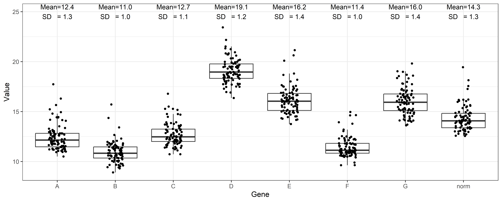

<!-- Changing h2 -->
<style>
h2 {
  color: #0073e6;
}
</style>

```{r setup, include=FALSE}

renv::init()
renv::install(c('dplyr','tidyverse','EnvStats'))
```

## Calling Required Packages


```{r warning=FALSE, message=FALSE}
library(dplyr)
library(tidyverse)
library(EnvStats)

```

\newline
\newline

## Reading data files

This analysis started with two files. The first one including expression data obtained using the Fluidigm System and the second one including clinical information from these patients. All files can be found in the 'Input files' folder.

```{r }

#Loading expression data
read.csv('Input files/resultados Placa TEG 29_09_23_dXPRESS.csv')->expr_data

expr_data<-expr_data%>%dplyr::filter(!(Name %in% c("PC 8","PC 9","PC 14",   
                                           "PC 22","PC 30","PC 45",
                                           "PC 63","775", "3014"))) #Excluding cases with neoadjuvancy and CECs
as.numeric(expr_data$Value)->expr_data$Value

```

## Subsetting housekeeping genes and showing expression levels

According with an in-parallel analysis ran in [NormFinder](https://www.moma.dk/software/normfinder) through [dXpress app](https://rdcu.be/dpQtN), genes 'A' and 'E' were the most relevant to normalize data. In this plot, their combination is shown as 'norm'

```{r message=FALSE, warning=FALSE}
expr_data<-expr_data%>%dplyr::select(-ID)

# Using ggplot2 to generate the boxplot+jitterplot 

p<-expr_data%>%
  subset(Gene %in% c("A","B","C","D","E","F","G"))%>%
  pivot_wider(names_from=Gene,values_from=Value)%>%
  mutate(norm=(A+E)/2)%>% #Selected genes using normfinder
  pivot_longer(!c(Name),names_to="Gene",values_to="Value")%>%
  ggplot(aes(x=Gene,y=Value))+geom_boxplot(outlier.shape = NA)+geom_jitter(size=1,width = .15)+
  theme_bw()+ stat_mean_sd_text(y.pos = 25,size=3.5) 

# Saving this result

png("Results/Housekeeping Profile.png",width = 6200,height = 2500,res=600)
p
dev.off()
```

```{r echo=FALSE }



```

## Session Info 

Saving Session Info and REnv...

```{r, echo=FALSE, warning = FALSE}
renv::init()
renv::snapshot()
sessioninfo::session_info() |> capture.output() |> writeLines("session-info.txt")

```

